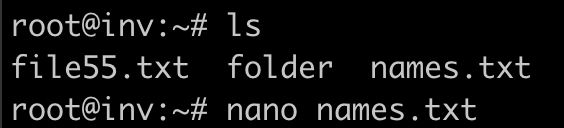
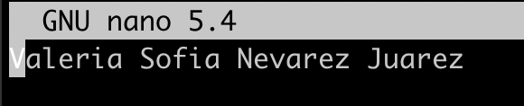

# Generar una carpeta en varios servidores

El siguiente repositorio contiene un archivo playbook.yml, el cual funciona para:

1) Genere una carpeta Alumnos

2) Dentro de la carpeta Alumnos genere un archivo con el nombre de cada participante del equipo.

Se configuraron 4 servidores:
1. **Bastion**: Contiene ansible y controla al resto de los servidores
2. **Sales**
3. **Accounting**
4. **HR**

Cada servidor contiene su propia dirección IP, las cuales fueron agregadas al archivo 	
	